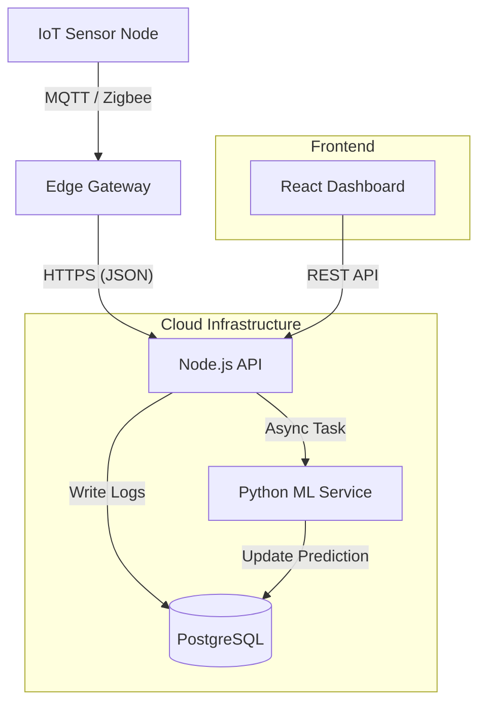

```mermaid
graph TD
    %% High-Level Architecture
    Sensor["IoT Sensor Node"] -->|"MQTT / Zigbee"| Gateway["Edge Gateway"]
    Gateway -->|"HTTPS (JSON)"| Backend["Node.js API"]
    
    subgraph Cloud Infrastructure
        Backend -->|"Write Logs"| DB[("PostgreSQL")]
        Backend -->|"Async Task"| ML["Python ML Service"]
        ML -->|"Update Prediction"| DB
    end
    
    subgraph Frontend
        Dashboard["React Dashboard"] -->|"REST API"| Backend
    end
```
